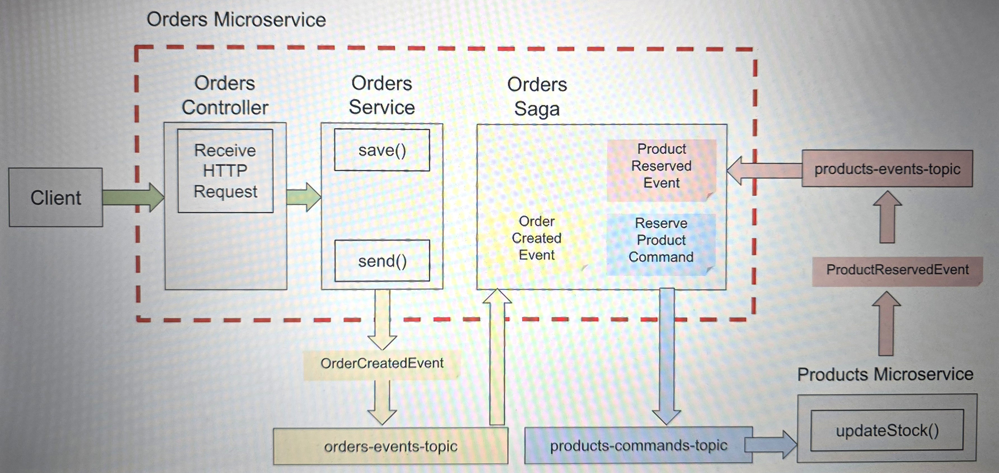

# event-driven-development-with-kafka

Я прохожу курс 
[Apache Kafka for Event-Driven Spring Boot Microservices](https://www.udemy.com/course/apache-kafka-for-spring-boot-microservices/)
на платформе Udemy.com.

Моя цель - познакомиться с Apache Kafka поближе. Думаю, что может пригодиться по работе, так как на соседних проектах 
используется. Да и на собеседованиях часто спрашивают.

---
В разделах 1-5 (занятия №1-35) были рассмотрены теоретические аспекты брокера сообщений (иногда его ещё называют 
распределённым журналом сообщений) Apache Kafka. Также проводилась практическая работа с Kafka CLI (интерфейсом 
командной строки).

Разумеется, от этих уроков никаких записей кода не осталось :wink:

---
В разделах 6-14 (занятия №36-114) был с нуля создан небольшой проект `products-app` с микросервисной архитектурой 
(четыре микросервиса). 

Модуль `products-microservice` - это реализация продюсера (producer). Сервис принимает информацию о продукте (например,
iPhone 15) в формате JSON, обрабатывает, и отправляет в брокер для дальнейшей обработки.

Модуль `email-notification-microservice` - это реализация консюмера (consumer). Сервис принимает новое сообщение от 
брокера, немного обрабатывает и выводит в консоль.

Модуль `core` - по сути, просто хранилище класса, объект которого мы обрабатываем, то есть отправляем из продюсера и принимаем
в консюмере.

Модуль `mockservice` был предоставлен преподавателем в готовом виде. Предназначен для проверки обработки исключений при
работе приложения. В зависимости от запроса, возвращает ResponseEntity со статусом либо 200, либо 500.

Также в разделах 17-18 (занятия №131-147) были написаны интеграционные тесты для двух основных модулей,
проверяющие работу Apache Kafka.

---
В разделах 15-16 (занятия №115-130) преподаватель предоставил готовые микросервисы приложения `deposits-app`. Я их 
немного подправила под свой code style + добавила Lombok.

Модуль `transfer-service` - это реализация продюсера, который работает с двумя топиками: `withdraw-money-topic` и 
`deposit-money-topic`.

Модули `withdrawal-service` и `deposit-service` - это реализации консюмеров. Каждый из них получает и обрабатывает
сообщения от соответствующего топика. Идея преподавателя в том, чтобы оформить передачу сообщений в оба консюмера
в рамках одной транзакции. То есть, сообщения должны быть переданы либо оба, либо ни одно из них.

По своей инициативе я написала интеграционные тесты на `transfer-service` для проверки транзакционности операции, а 
также на `withdrawal-service` и `deposit-service` (проверила правильность логирования, там больше нечего было 
проверять :slightly_smiling_face:).

Модуль `core` - это хранилище двух классов, объекты которых мы отправляем из продюсера и принимаем в консюмерах. Также
содержит объекты классов-исключений, повторяемого и неповторяемого.

Модуль `mockservice` - это всё тот же сервис-заглушка для проверки обработки исключений. В зависимости от запроса, 
возвращает ResponseEntity со статусом либо 200, либо 500.

---
В разделах 19-20 (занятия №148-180) было также предоставлено готовое приложение `saga-pattern-app`, состоящее из пяти
микросервисов: трёх основных и двух вспомогательных. Я их отрефакторила под свой code style, добавила Lombok. 
Наша задача состояла в реализации Saga Design Pattern (orchestration-based), чтобы связать микросервисы в единое приложение.

Общая схема приложения:

Модуль `core` представляет собой хранилище всех используемых POJO-классов, а также DTO, исключений, вспомогательных 
перечислений и констант. В том числе, в модуле содержатся классы для описания событий (events) и команд (commands).

Модули `orders-service`, `products-service` и `payments-service` являются как продюсерами, так и консюмерами. Класс-оркестратор
OrderSaga находится в модуле `orders-service` и организует связанную работу микросервисов. Оркестратор слушает все
топики, связанные с событиями, и, в зависимости от полученного события, формирует и отправляет в Apache Kafka команду.
Микросервисы, соответственно, слушают каждый свой топик, связанный с командами, и, реагируя на полученную команду,
формируют и отправляют в Apache Kafka новое событие. Если событие фиксируется как успешное (например, заказ создан, товар
забронирован, оплата прошла), создаётся команда для продолжения процесса обработки заказа. Если же на каком-то этапе
что-то пошло не так (например, товара нет в наличии, оплата не прошла), запускается процесс поэтапной отмены 
заказа путём формирования компенсирующих команд и событий.

Модуль `credit-card-processor-service` - по сути, заглушка. К нему обращается `payments-service` для подтверждения оплаты 
заказа, и всегда получает положительный ответ. Для проверки процесса отмены заказа модуль `credit-card-processor-service`
следует остановить. Тогда, соответственно, при обращении к нему `payments-service` получит в ответ ошибку 500 и сформирует
событие "оплата не прошла".

---
Раздел 21, помеченный как аппендикс А :slightly_smiling_face:, содержит подробную инструкцию по запуску Kafka-кластера
с тремя брокерами в Docker-контейнере с помощью файла docker-compose.yml. Ох, и как же я пожалела, что не прошла эти
уроки ранее, до начала работы с микросервисами! :slightly_frowning_face: Ведь всё это время я каждый раз запускала такой
Kafka-кластер с командной строки! :face_with_spiral_eyes:

Чтобы разобраться с Apache Kafka на уровне Java-разработчика, информации более чем достаточно. В курс входят: теория, 
много практики, квизы для проверки усвоенного материала. Рекомендую! :+1: